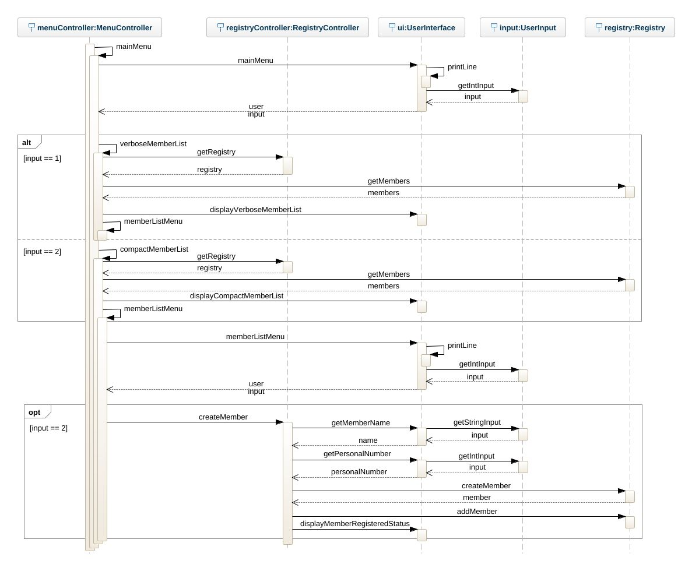

# Boatclub OO-Design
This document describes the design according to the requirements presented in assignment 2.

## Architectural Overview
The application uses the model-view-controller (MVC) architectural pattern. The view is passive and gets called from the controller. The view may only read information from the model, not directly change it.

## Detailed Design
### Class Diagram

<!-- Please provide at least one class diagram according to the assignment requirments. -->
The class diagram represents a member registry application for a boat club. The application uses the MVC architecture (model, view and controller package). I would have improved the controllers coupling if I had more time. Both the MenuController and RegistryController has a dependency to the Member class. This is not good because of the GRASP pattern low coupling. A better solution would be to move all Member dependencies to the RegistryController.

### Sequence Diagram

<!-- Please provide at least one sequence diagram according to the assignment requirments. -->
The squence diagram represents the scenario when a member is being created. The starting point (mainMenu) could be after the application has started and loaded all persistent data or when the user is going back to the main menu. The user must select verbose or compact memberlist because the create member alternative is located in the member list menu.